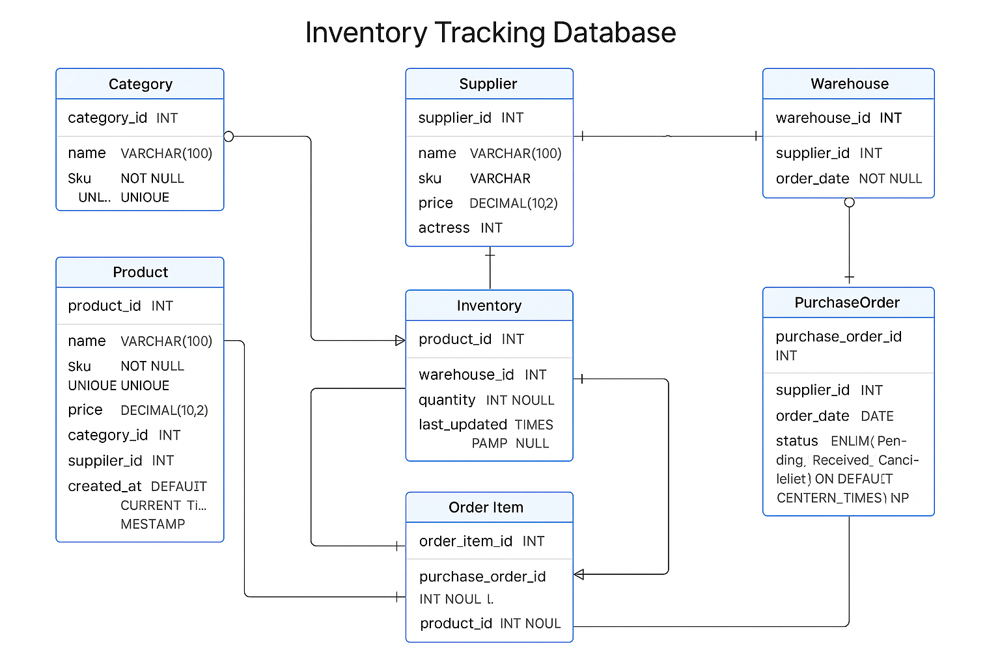

# 🧾 Inventory Tracking System (MySQL Database)

## 📌 Project Description

This project is  built with **MySQL 8.0** designed to manage inventory..

## Objective:
Design and implement a full-featured database using only MySQL to create:

- Tables with proper constraints (`NOT NULL`, `UNIQUE`, `Primary Key (PK),` `Foreign Key(FK)`)
- Relationships:
  - One-to-Many
  - One-to-One
  - Many-to-Many

## ⚙️ How to Set Up and Run

### ✅ Requirements

- MySQL Server (version 5.7+ or 8+)
- MySQL Workbench or any SQL client

### 📥 Steps to Import

1. **Download** the `inventory_tracking.sql` file (provided).
2. **Open** MySQL Workbench or your preferred MySQL GUI.
3. **Create a new schema** (e.g., `inventory_db`).
4. **Select your schema**, then **open and run** the SQL file.
5. The tables and constraints will be created automatically.

## 🖼️ Entity Relationship Diagram (ERD)

> 📷 **ERD Screenshot Placeholder**

## 👨‍⚕️ Relationships

- One-to-Many: Category → Product 
    ** One category can have many products but a product only belongs  one  category.
- Many-to-One: Products → Category
    ** Many Products of different orgin e.g Samsung, Iphone, Nokia can only be classified to one category Phone.
- Many-to-Many: PurchaseOrder ↔ Product
    ** A purchase order may contain many products
    ** A product may be ordered in many purchase orders
    This is managed using the OrderItem junction table

## 👤 Author

Built by [Cyrus Nderitu]  
© 2025 Inventory Tracking DB

